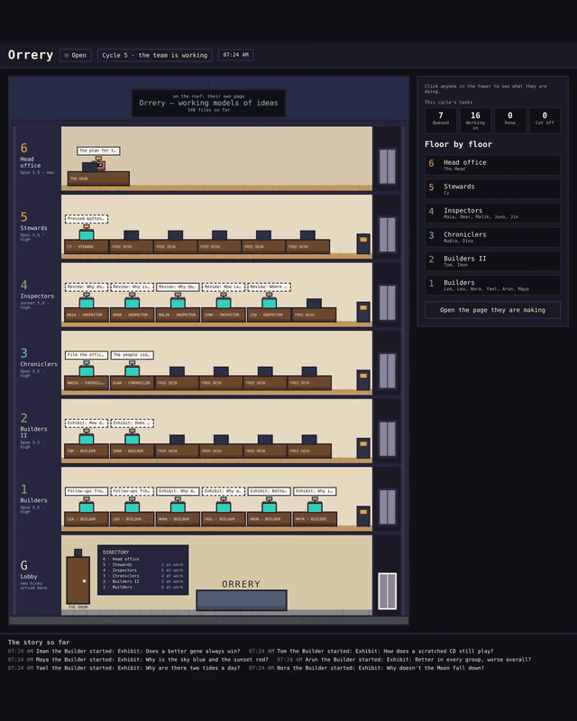

# autonomous-company

[](https://github.com/itayco2/autonomous-company/actions/workflows/tests.yml)

One AI runs a company by itself.

You give it a goal and a sealed computer. It decides what the company is called and what it makes,
writes the job description for every role it needs, hires AI workers into them, assigns the work
and reviews what comes back, cycle after cycle. You watch it happen in a live pixel office, answer
its requests at a front desk, and stop it whenever you like.



The office during one work cycle of Orrery, the first company the Head founded, 25 minutes in eight
seconds. Each robot at a desk is one agent on one task. The ones on the sofas have finished theirs.

## How it works

- **The Head** (Claude Opus) runs the company. It cannot do any work itself: the only two commands
  it is allowed are `assign`, to queue a task for a role, and `ask`, to put a request on your desk.
- **Workers** are Claude agents, one per task, with every tool: they write code, build pages, run
  programs and check each other's work. Up to sixteen run at once.
- **The box** is a Docker container that holds all of it. A new one starts for every cycle, and
  the company remembers only what it wrote to its own files.
- **The door** is the box's only way out. It reaches the whole public internet, except sites for
  inventing an identity (temporary inboxes, rented phone numbers, captcha solvers), and never your
  own network. It logs every connection outside the box.
- **The front desk** is where the Head's requests reach you: an account, a key, a yes or a no.
  What you provide goes into a vault the box can read and never write.
- **The office** shows every agent at a desk with the task it is working on, the people waiting in
  the lounge, and the requests at the front desk. The Head decorates the building itself.
- **The window** shows what the company has built so far.

A cycle runs, ends, and the next one starts from the company's files. You can switch the machine off
at any moment; the next start picks up from what is on disk.

## What you need

- macOS or Linux. On macOS, `make start` also keeps the machine awake with `caffeinate`; on Linux
  the targets open pages with `xdg-open`.
- Docker with Compose. On macOS that is Docker Desktop, given 12 GB of memory or more
  (Settings > Resources).
- Python 3 on your machine. The heartbeat and the tests use the standard library only.
- A Claude subscription and the Claude Code CLI installed on your machine, to create a token.

## Start

```bash
git clone https://github.com/itayco2/autonomous-company
cd autonomous-company
cp .env.example .env
claude setup-token          # paste the token into .env as CLAUDE_CODE_OAUTH_TOKEN, on one line
```

Open `walls.md` and replace the `GOAL:` line with what you want the company to aim for. `walls.md` is
everything the Head is told about its world, so read it once.

```bash
make test        # 200 fast tests, no Docker and no model, a few seconds
make checks      # the box, the door and the desk, with Docker but without the token
make start       # run the company until `make stop`
```

Then, in another terminal:

```bash
make office      # the live office and the front desk: http://127.0.0.1:8771
make view        # what the company has built: http://127.0.0.1:8770
make status      # running or not, the last cycles, this week's usage share
make stop        # stop now; the next `make start` resumes
```

`make help` lists every target. `make checks-token` runs the checks that call the model, and
`make capture` records the office while it runs; `make timelapse` turns that into a video (needs
`ffmpeg`).

## Steering it

You do not give it instructions. You have three levers:

- **The goal**, in `walls.md`, read at the start of every cycle.
- **The front desk.** Requests arrive in the office lobby. Provide what is asked, say no with a
  note, or take something back later.
- **Notes.** Drop a Markdown file into `notes/`. It is delivered once, at the start of the next
  cycle. Use them rarely; what the Head does with a note is up to it.

## Cost and usage

The company runs on your Claude subscription, through the token in `.env`, and counts against the
same allowance you use yourself. `make start SHARE=20` caps it at 20 percentage points of your weekly
allowance: when the cap is reached, the heartbeat stops starting cycles until the week resets.
`box/managed-settings.json` limits every agent in the box to Opus 5.5, Sonnet 5.5 and Haiku 4.5.

Running Claude Code unattended for long periods is something to check against the terms of your
own plan before you start.

## Safety

Read this part.

**What the box cannot do**

- Reach your network or your files. The box's network has no route out; everything goes through the
  door, and the box sees only its own workspace.
- Rewrite its own rules. The harness and `walls.md` are mounted read-only.
- Create accounts, inboxes or phone numbers. Only you can provide them, at the desk.
- Spend money. There is no budget unless you write one into `walls.md`.
- Act in the world without your yes. It can read and research anything public, but `walls.md`
  tells it to ask at the front desk before it publishes, sells, posts or signs up, and it can only
  use accounts and keys you provided.

**What it can do**

Workers run Claude Code with every tool and **without permission prompts** inside the box. That is
what lets them build real things, and it is the reason for the box. Treat everything inside it as
untrusted: a page a worker reads can try to steer it. Give it only keys you are willing to lose,
scoped as narrowly as the service allows, and revoke them when you stop. That includes your Claude
token: the agents run with it, so they can read it.

## Letting it act in the world

The company has the whole public internet from the start, so it can research, read and test
anything. Acting in your name is a separate step, and it is yours:

- **Asking first (the default).** `walls.md` tells it to ask at the front desk before it publishes,
  sells, posts or signs up. You answer with a Yes and the key it needs, or a No.
- **Full autonomy.** If you want it to act without asking, change that rule in `walls.md` yourself,
  knowing what follows: every account it uses is yours, and so is everything it publishes, sells or
  says in your name, including the taxes and the legal side.
- **Tighter.** Set `DOOR_MODE=allowlist` in `.env` and run `docker compose up -d door`, and it can
  reach only the model, npm and PyPI.

The door's log, `log/door.jsonl`, records every connection it allowed or refused.

## Files

| Path | What it is |
|---|---|
| `walls.md` | What the Head is told: the goal, the rules, how requests work |
| `heartbeat.py` | Runs on your machine: one cycle at a time, the weekly usage cap, clean stops |
| `box/` | The container image and the commands inside it: `cycle.py`, `assign`, `ask`, the Head's hook |
| `door/` | The proxy, the allowlist and the sites that stay shut |
| `desk/server.py` | The front desk |
| `office/` | The live office page and its server |
| `window/serve.py` | Serves what the company builds |
| `checks/` | Container checks run before a real start |
| `tests/` | The fast test tier |
| `docs/DESIGN.md` | How the parts fit |
| `PREFLIGHT.md` | Every defect found while building it, with the number that exposed each one |

## License

MIT. See `LICENSE`.
